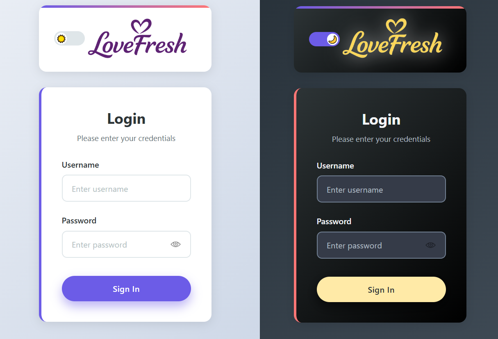
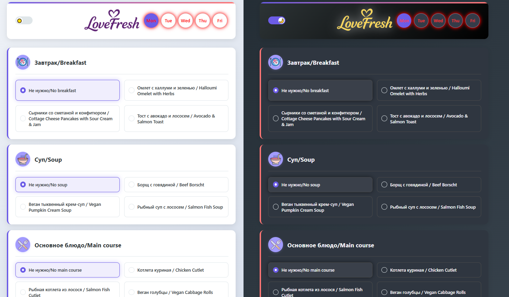
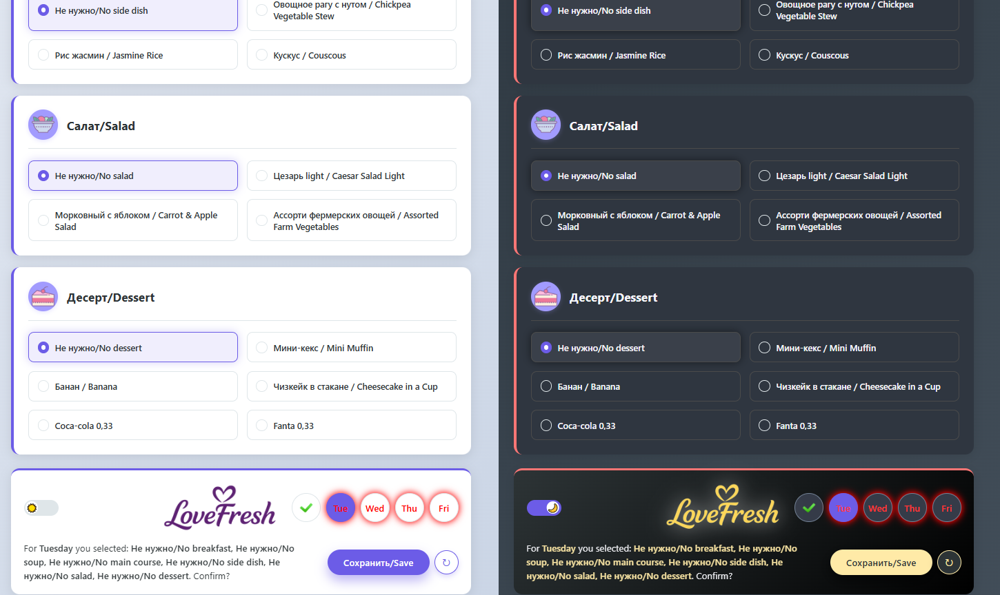
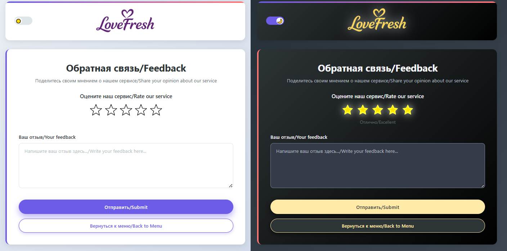

# Catering App

Веб-приложение для управления ежедневным выбором питания в корпоративном кейтеринге.  
Проект ориентирован на использование в реальной среде и закрывает потребности:
- **пользователей** (понятный интерфейс выбора меню и отправки обратной связи),
- **команды разработки и сопровождения** (прозрачная архитектура, документация, развёртывание через Docker).

## 1. Цели проекта

- Обеспечить удобный сценарий: **авторизация → выбор блюд по дням → сохранение → обратная связь**.
- Гарантировать стабильную работу API за счёт локальной БД SQLite.
- Сохранить интеграцию с Google Sheets как внешним источником данных через контролируемый импорт.
- Поддержать безопасную аутентификацию с JWT-сессией до 30 дней.

## 2. Технологический стек

- **Frontend:** React, TypeScript, Vite
- **Backend:** FastAPI, SQLAlchemy, Pydantic Settings
- **Auth:** JWT (HS256)
- **Хранение данных:** SQLite
- **Интеграция:** Google Sheets API (импорт в SQLite)
- **Инфраструктура:** Docker Compose, nginx

## 3. Ключевые возможности

- JWT-авторизация с хранением токена в браузере и восстановлением сессии.
- Защищённые API-маршруты с проверкой Bearer-токена.
- Хранение меню, недель, пользовательских выборов и обратной связи в SQLite.
- Автоматический импорт данных из Google Sheets при старте backend.
- Ручной импорт данных без перезапуска через `POST /sync_from_sheets`.
- Кэширование часто читаемых данных (меню/недели) на backend.

## 4. Архитектурная схема

```text
Frontend (React SPA)
        |
        v
Backend API (FastAPI) -> Service Layer -> Repository Layer -> SQLite
        |
        └> Optional import: Google Sheets -> SQLite snapshot
```

## 5. Скриншоты интерфейса

### Экран авторизации
Экран входа в систему с JWT-аутентификацией и восстановлением сессии.


---

### Меню
Основной экран приложения: выбор блюд по дням и сохранение предпочтений пользователя.


---

### Меню
Основной экран приложения: выбор блюд по дням и сохранение предпочтений пользователя.


---

### Обратная связь
Форма обратной связи для оценки качества питания и отправки комментариев.



## 6. Быстрый запуск (Docker)

### 6.1. Предварительные требования

- Установлен [Docker Compose](https://docs.docker.com/compose/).

### 6.2. Подготовка переменных окружения

1. Скопируйте `.env.compose.example` в `.env` в корне проекта.
2. Укажите минимум:
   - `JWT_SECRET` — секрет подписи JWT;
   - `SPREADSHEET_ID` и `SERVICE_ACCOUNT_PATH` — если требуется импорт из Google Sheets.

### 6.3. Запуск

```bash
docker compose up --build
```

После запуска приложение доступно по адресу: `http://127.0.0.1:8080`  
(или по порту из `WEB_PORT`).

## 7. Локальный запуск для разработки

### 7.1. Backend

```bash
cd backend
python -m pip install -r requirements.txt
copy .env.example .env
python run.py
```

Для импорта из Google Sheets:
- поместите `service_account.json` в `backend/`;
- задайте `SPREADSHEET_ID` в `backend/.env` (или используйте `backend/table_id`).

### 7.2. Frontend

```bash
cd frontend
npm install
npm run dev
```

По умолчанию frontend доступен на `http://127.0.0.1:5173`.

## 8. Документация проекта

- Контракт API: `docs/api-contract.md`
- Чеклист тестирования: `docs/qa-checklist.md`